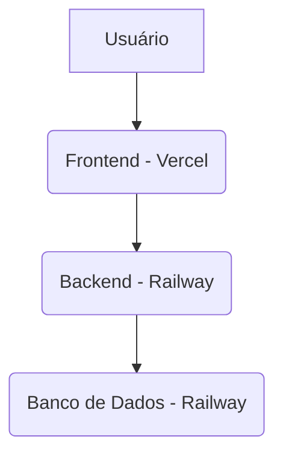

# O Que é Vercel e Por Que é a Melhor Opção para Você?

**Data:** 12/12/2025  
**Autor:** Manus AI

## 1. O Que é Vercel?

O Vercel é uma plataforma de nuvem especializada em hospedar **interfaces de usuário (frontend)** de forma rápida, eficiente e escalável. Ele foi criado pelos mesmos desenvolvedores do Next.js, um dos frameworks React mais populares do mundo.

**Analogia:**

- **Railway:** É como um "canivete suíço" - bom para tudo (backend, banco de dados, frontend), mas não é o melhor em tudo.
- **Vercel:** É como uma "faca de chef" - especializado e perfeito para uma única tarefa: hospedar o frontend.

## 2. Por Que Vercel é Melhor que Railway para o Frontend?

| Característica | Vercel | Railway |
| :--- | :--- | :--- |
| **Especialidade** | Frontend (React, Vite, etc.) | Backend, Banco de Dados, Tudo |
| **Performance** | ⭐⭐⭐⭐⭐ (CDN Global) | ⭐⭐⭐ (Servidor único) |
| **Deploy** | 30-60 segundos | 3-5 minutos |
| **Cache** | Inteligente e instantâneo | Agressivo e problemático |
| **Custo** | Grátis (generoso) | Pago (com créditos) |
| **Escalabilidade** | Automática e global | Manual e regional |

## 3. Como Funciona a Arquitetura Recomendada?

A arquitetura profissional e moderna que estou sugerindo é:

**Fluxo:**

1. O usuário acessa `www.markthubcrm.com.br` (hospedado no Vercel).
2. O Vercel entrega a interface (frontend) de forma instantânea.
3. A interface faz requisições para `api.markthubcrm.com.br` (hospedado no Railway).
4. O Railway (backend) processa a lógica e acessa o banco de dados.

**Benefícios:**

- ✅ **Performance Máxima:** O usuário recebe a interface do local mais próximo dele (CDN do Vercel).
- ✅ **Segurança:** O backend e o banco de dados ficam protegidos no Railway.
- ✅ **Escalabilidade:** O frontend e o backend podem escalar de forma independente.
- ✅ **Sem Problemas de Cache:** O Vercel gerencia o cache de forma inteligente.

## 4. Vantagens para o Markethub CRM

### **1. Resolve o Problema de Cache**
O Vercel tem um sistema de cache que invalida automaticamente quando você faz um novo deploy, garantindo que os usuários sempre vejam a versão mais recente.

### **2. Melhora a Experiência do Usuário**
O site carregará mais rápido para os seus clientes, pois o Vercel distribui o conteúdo globalmente.

### **3. Reduz Custos**
O plano gratuito do Vercel é muito generoso e provavelmente será suficiente para o seu projeto, reduzindo os custos com o Railway.

### **4. Facilita a Manutenção**
Deploys mais rápidos e confiáveis significam que novas funcionalidades e correções chegam mais rápido aos seus usuários.

## 5. Próximos Passos

Se você aprovar, posso iniciar a migração agora. O processo é simples e rápido (15-20 minutos):

1. **Configurar o projeto no Vercel**
2. **Fazer o primeiro deploy**
3. **Apontar o domínio `www.markthubcrm.com.br` para o Vercel**
4. **Configurar o CORS no Railway** para aceitar requisições do Vercel

---

**Conclusão:** Migrar o frontend para o Vercel é a decisão técnica mais correta e profissional para o seu projeto. Isso não apenas resolverá o problema atual, mas também trará benefícios de performance, custo e escalabilidade a longo prazo.
